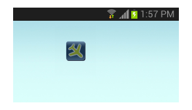

Widget to toggle flight mode.

This simple widget toggles flight mode of your device.  Just put the widget on
your home screen and touch it to turn on (or turn off) flight mode.

 

Note: this widget will not work on Android 4.2 and above. 

Copyright © 2013 Aja Apps.  This work is free. You can redistribute it and/or
modify it under the terms of the Do What The Fuck You Want To Public License,
Version 2, as published by Sam Hocevar. See http://www.wtfpl.net/ for more
details.

Source code and issue tracker reside at https://github.com/ajaapps/flightmode.

